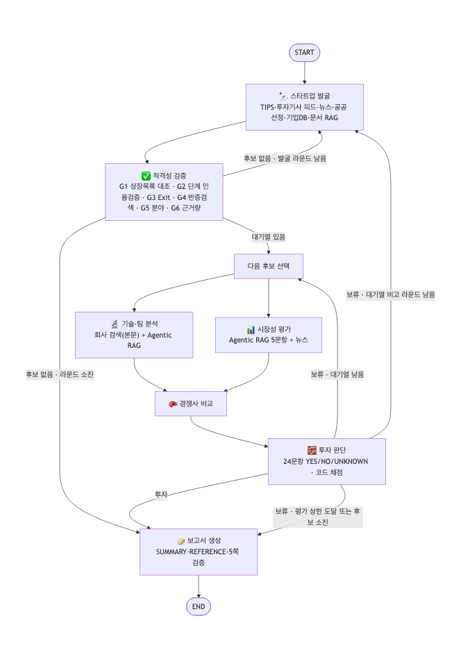

# AI Startup Investment Evaluation Agent
본 프로젝트는 AgTech 스타트업에 대한 투자 가능성을 자동으로 평가하는 에이전트를 설계하고 구현한 실습 프로젝트입니다.

SKALA 울산캠퍼스 2반 1조

- 설계 산출물: [docs/design.md](docs/design.md) · PDF `docs/RAG-Design_울산-2반_김가연+김진녕+문지후+이준희+정승우.pdf`
- 투자 보고서: `outputs/RAG-Output_울산-2반_김가연+김진녕+문지후+이준희+정승우.pdf` (5쪽)


## Overview
- Objective : 비상장 · Seed~Series C · Exit 전 AgTech AI 스타트업을 공개 정보로 발굴·검증하고, 창업팀·시장성·제품·경쟁 우위·실적·투자조건을 기준으로 투자 적합성을 평가해 임원 보고용 PDF(5쪽 이내)를 만든다
- Method : LangGraph Multi-Agent(7개) + Agentic RAG(검색 → 관련성 판정 → 질의 재작성 → 웹 보완) + 근거 인용을 코드로 검증하는 24문항 평가표


## Features
- **회사 사건 기반 스타트업 발굴** : 창업자(링크드인) 검색 대신 TIPS 선정 목록(운영사 선투자 = Seed 이력 보장), 투자 유치 기사 피드, 공공 선정, 기업 DB, 문서 RAG 등 8개 채널에서 날짜가 찍힌 공개 사건으로 후보 발굴 → 이번 실행 85곳 (2채널 이상 교차 신호 18곳)
- **적격성 관문 G1~G6** : 한국거래소 상장 목록과 코드로 대조(못 불러오면 통과 불가), 투자 단계는 "회사명+단계"가 함께 적힌 원문 인용으로만 인정, 인수·폐업 반증 검색 → 정확도 1.00(20개사), 홀드아웃 1.00(10개사)
- **"창업 시기"를 공공데이터로 확인** : 링크드인 팔로워 수는 가입한 날부터 쌓여 창업 시점과 맞지 않는다. 대신 국민연금 가입 사업장 내역(키 불필요)으로 회사의 최초 가입일(첫 고용 시점)·현재 인원·탈퇴 여부를 확인하고 보고서에 출처와 함께 적는다 (예: 메타파머스 가입자 19명, 최초 가입 2023-03-01)
- **기사 원문 수집** : 검색 스니펫 대신 근거 기사 본문 전체와 원문 게시일을 받아 창업자 이력·실적·계약 근거를 보강
- **Agentic RAG** : 공공·국제기구·학술 문서 13종(196쪽)에서 하이브리드 검색 → Judge LLM 관련성 O/X → 부족하면 질의 재작성(최대 2회) → 그래도 부족하면 웹 보완
- **근거 검증형 평가표** : Scorecard 가중치(30/25/15/10/10/10) × Bessemer 체크리스트 = 24문항 YES/NO/UNKNOWN. YES·NO 모두 원문 인용이 실제 근거 본문에 있어야 인정(이번 실행에서 LLM 의 YES 중 7건을 코드가 강등, "근거 없음"을 NO 로 쓴 판정은 UNKNOWN 으로), 점수와 결론은 코드가 계산
- **보고서 형식·내용 자동 검증** : 5쪽 이내, SUMMARY A4 절반 이내(렌더링 후 높이 측정, 이번 20%)·개요 문장 금지, 결론 줄은 코드가 작성, 평가표와 어긋나는 단정(예: 특허 미확인인데 "특허 보유")은 다시 쓰게 함
- **재현성** : 검색 결과·발굴 스냅샷·LLM 응답·색인을 `replay/` 에 담아, 새로 받은 저장소에서 API 키 없이도 같은 보고서 재생성


## Tech Stack
- Framework : LangGraph 1.2, LangChain 1.4, Python 3.11
- LLM/Generator : gpt-4.1-mini
- LLM/Judge : gpt-4.1-mini (같은 모델의 자기 평가 편향은 이진 판정 + 인용 코드 검증으로 보완)
- Retrieval : FAISS + Kiwi BM25 하이브리드(0.3:0.7, RRF) - Hit Rate@8 0.986, MRR@5 0.796 (질문 70개, 한국어 문서 MRR 0.923)
- Embedding : dragonkue/snowflake-arctic-embed-l-v2.0-ko (오픈소스, Apache-2.0)
- 그 밖 : 웹 검색 Tavily (키가 있는 공급자를 Serper(구글) → Tavily 순서로 시도, 한도 초과면 다음 공급자로), 기사 원문 수집 trafilatura, 국민연금 가입 사업장 내역(공공데이터포털), 한국거래소 KIND·FinanceDataReader, Playwright(PDF), uv


## Agents
| 에이전트 | 한 가지 책임 | RAG |
|---|---|---|
| 🔭 스타트업 발굴 | 8개 채널에서 후보 수집, 교차 신호로 우선순위 | O (문서 속 선정 기업·사례) |
| ✅ 적격성 검증 | 관문 G1~G6 (비상장·Seed~C·Exit 없음·부정 신호 없음·AI 핵심 AgTech·근거량) | X |
| 🔬 기술·팀 분석 | 제품·기술·성숙도·특허·창업자 이력 (기사 본문 + 코퍼스 속 회사 언급) | O (분야 기술 기준선) |
| 📊 시장성 평가 | 국내·글로벌 규모, 성장, 수요, 정책, 도입 장벽 | **O (Agentic RAG 6문항)** |
| 🥊 경쟁사 비교 | 기술·팀이 주장한 차별점을 국내외 경쟁사와 비교 | X |
| 🧮 투자 판단 | 24문항을 항목별로 따로 판정, 인용·제3자·최근성 검사, 점수·결론 계산 | △ (수집 근거 재검색) |
| 📝 보고서 생성 | SUMMARY → 7개 장 → REFERENCE, 형식·평가표 일치 검증 후 PDF | X |

가이드의 에이전트 정의(안)에서 바꾼 점: 가장 어려운 "탐색"을 발굴(재현율)과 적격성 검증(정밀도)으로 나눴고, 창업자 항목(30%)을 위해 기술 요약에 팀 분석을 합쳤으며, 서로 독립인 기술·팀 분석과 시장성 평가는 병렬로 실행한다.


## Architecture


- 보류면 대기열의 다음 후보 → 대기열이 비면 다시 발굴(최대 2라운드) → 평가 상한(4곳)이나 후보 소진 시 보고서 ("모두 보류면 루프 종료 후 보고서")
- 컴파일된 그래프 원본: `docs/architecture_langgraph.png` (설계와 같은 노드·간선)


## Directory Structure
```
├── data/
│   ├── corpus/               # RAG 문서 13종 (196쪽, 과제 한도 200쪽)
│   ├── manifest.yaml         # 문서 메타데이터 (발행기관·연도·URL → REFERENCE)
│   └── eval/                 # 검색 평가 질문 70개, 적격성 정답 30개사
├── agents/                   # 에이전트 7개
├── graph/                    # State 정의, 그래프 구성
├── rag/                      # 전처리·조각·임베딩·하이브리드 검색·Agentic RAG 서브그래프
├── tools/                    # 웹 검색(Serper·Tavily), 발굴 채널, 상장 목록 대조, 국민연금 조회, 기사 원문 수집, 근거 저장소·인용 검증
├── core/                     # 설정, LLM, 비용 집계, 프롬프트 로더
├── prompts/                  # 프롬프트 템플릿
├── report/                   # 보고서 HTML 템플릿, PDF 렌더링
├── eval/                     # 검색·적격성·LLM Judge 평가 스크립트
├── docs/                     # 설계 문서(md·PDF), 아키텍처 그림
├── outputs/                  # 투자 보고서 PDF, 실행 로그, 평가 결과
├── replay/                   # 재현용 캐시 (검색 결과·스냅샷·LLM 응답·색인)
├── config.yaml               # 모델명·검색·반복 상한·판단 기준 (코드에 하드코딩하지 않음)
├── rubric.yaml               # 투자 판단 평가표 24문항
├── app.py                    # 실행 스크립트
└── README.md
```


## Usage
```bash
uv sync                                    # 또는: pip install -r requirements.txt  (Python 3.11)
uv run playwright install chromium         # PDF 생성용 브라우저 (처음 한 번)
python app.py                              # 제출본 재현 → outputs/RAG-Output_*.pdf  (uv 환경이면 uv run python app.py)
```
- `python app.py --offline` : 재현 테스트. 캐시에 없는 호출이 생기면 바로 실패하므로 **API 키 없이** 제출본이 그대로 나오는지 확인한다 → 새 clone 에서 통과 기록: [outputs/eval/repro_check.md](outputs/eval/repro_check.md)
- `python app.py --fresh` : 오늘 기준으로 새로 평가 (`.env` 에 OPENAI_API_KEY 와 검색 키 SERPER_API_KEY 또는 TAVILY_API_KEY 필요 · 약 8분 · LLM 약 $0.3)
- `python app.py --retry-failed` : 제출 실행 때 검색 한도 초과로 비었던 검색만 다시 시도해 근거를 보강
- `python app.py --graph-only` : 아키텍처 그림만 생성 / `python -m docs.build_design` : 설계 문서 생성
- 평가 재현 : `python -m eval.eval_retrieval` · `eval.eval_final_retriever` · `eval.eval_eligibility [holdout]` · `eval.eval_judge`
- Windows 는 영문 경로(예: `C:\work\RAG-project`)에 받는 것을 권장한다. `--fresh` 로 문서 색인을 새로 만들 때만 임베딩 모델(약 2GB)을 내려받는다


## Evaluation
| 무엇을 | 방법 | 결과 |
|---|---|---|
| 임베딩 6종 | 질문 70개(자연어형 40·키워드형 30), 정답 = 같은 문서·페이지 | KURE-v1·snowflake-arctic-ko 상위 동률 → 파이프라인 지표(Hit@8)·한국어 순위로 선택 |
| 최종 검색기 | Hybrid vs Dense vs BM25 | Hit@8 0.986 / Dense 0.971 / BM25 0.700 |
| Agentic RAG 답변 | LLM-as-a-Judge O/X, 20문항 | Relevance 1.00 · Faithfulness 0.95 · Correctness 0.95 (재작성 20%, 웹 보완 20%) |
| 적격성 검증 | 사람이 교차 검증한 정답 | 개선용 20개사 1.00 · **홀드아웃 10개사 1.00** |
| 전체 실행 | `outputs/run_log.json` | 발굴 85곳 → 검증 16곳 → 적격 14곳 → 심층 평가 4곳, `--offline` 재현 6초 (LLM API 호출 0회, 캐시 102건) |


## 차별점
1. **발굴을 "사람"이 아니라 "회사 사건"으로** : 과제의 스타트업 조건(비상장·단계·Exit)을 코드로 확인할 수 있는 데이터만 쓴다
2. **LLM 이 지어낸 근거를 코드가 걸러낸다** : 투자 단계·평가표 YES·NO 모두 원문 인용 검증(인용이 원문에 없으면 한 번 다시 묻고, 그래도 없으면 UNKNOWN), 회사명 없는 업계 일반론·다른 회사 이야기·자사 발표만 있는 성능 수치·24개월 지난 실적은 자동 강등
3. **모든 선택을 측정으로 결정** : 임베딩·가중치·검색 방식·적격성 로직을 정답셋으로 재고 고쳤다 (홀드아웃으로 과적합도 확인)
4. **임원 보고 형식을 코드로 보장** : 결론 줄·5쪽·SUMMARY 높이·REFERENCE 형식·평가표와의 일치를 렌더링 후 검사


## 투자 보고서 핵심
- 결론: **투자 권고 대상 없음** — 85곳 발굴 → 적격 14곳 → 심층 평가 4곳 모두 보류
- 메타파머스 60.0점 (UNKNOWN 46%) — 점수 미달(60.0점), 정보 부족(UNKNOWN 46%)
- 새팜 40.0점 (UNKNOWN 62%) — 점수 미달(40.0점), 핵심 항목 미달(창업자 0%), 정보 부족(UNKNOWN 62%)
- 리비타 25.0점 (UNKNOWN 71%) — 점수 미달(25.0점), 핵심 항목 미달(창업자 0%), 정보 부족(UNKNOWN 71%)
- 조벡스 25.0점 (UNKNOWN 79%) — 점수 미달(25.0점), 핵심 항목 미달(창업자 25%), 정보 부족(UNKNOWN 79%)
- 최고점 메타파머스 — 원문 인용으로 확인: 창업팀 이력, 기술 책임자 이력, 최근 마일스톤, 시장 규모, 시장 성장, 경제적 효과, 수익 모델, 상용 운영, 자체 기술, 최근 라운드, 기관투자자 / 근거 미공개: **매출, 유료 고객·설치 규모, 재계약, 특허, 인허가, 경쟁사 대비 차별점** → 보류
- 모두 보류이므로 보고서 6장에 **후보별 보류·탈락 사유 표**(보류 사유, 반대 근거가 있는 문항, 확인되지 않은 문항)를 코드가 평가 결과로 작성
- 보고서의 "조건" 줄과 리스크 표가 곧 **실사 체크리스트** (매출·고객 수의 제3자 근거, 특허, 인허가·검정 현황)


## Lessons Learned
1. **하이브리드가 늘 좋은 것은 아니었다** : 한국어 문서에서는 Kiwi BM25 단독이 강했지만(MRR 0.902) 한국어 질문으로 영어 문서를 찾을 때는 거의 실패했다(0.188). 하이브리드는 한국어 순위를 올리고(0.923) 영어 순위를 떨어뜨렸다(0.593). 그래서 Judge 가 실제로 보는 "후보 8개 안 적중"(Hit@8)으로 골랐다
2. **기본값을 의심하라** : 0.5:0.5 가중치는 모든 임베딩에서 가장 나빴고, Qwen3 임베딩은 지시문 끝 공백 하나를 고치자 MRR 0.40 → 0.80
3. **LLM 판단은 재야 믿을 수 있다** : 적격성 에이전트의 첫 정확도는 0.50 이었다(투자 기사에 AI 설명이 없다고 탈락, 다른 회사의 단계를 가져옴). 3가지 값 판정·인용 검증·과거 사건 검색 방식 변경으로 1.00, 과적합을 의심해 만든 홀드아웃에서도 1.00
4. **날짜 함정** : 게시일이 없는 기사에 조회일을 보여 주자 LLM 이 2022년 투자를 "2026년 9월 투자"로 읽었다. 조회일은 LLM 에 숨기고 본문·URL 에서 게시일을 찾는다
5. **근거를 엄격히 하면 UNKNOWN 이 늘어난다, 그리고 "없음"과 "반대"는 다르다** : 초기 스타트업은 매출·고객·특허를 공개하지 않는 경우가 많다. 근거 없는 YES 를 막은 대가로 "정보 부족 보류"가 늘었고, 그 항목을 보고서의 실사 항목으로 넘겼다. LLM 은 "근거가 없다"를 NO 로 쓰기도 해서, NO 에도 반대 사실의 원문 인용을 요구했다
6. **재현성은 코드만의 문제가 아니다** : 캐시 키에 제외 도메인 목록을 넣었다가 목록 한 줄을 고치자 재현용 캐시 전체가 무효가 됐다. 상장 목록 라이브러리 버전 하나로 관문이 조용히 꺼질 뻔했고(실패 시 통과 불가로 설계), LangSmith 월 한도·Tavily 검색 한도가 차서 자체 비용 집계와 실패 표시 캐시를 넣었다
7. **검색 API 보다 공공데이터가 튼튼했다** : 제출 전날 Tavily 무료 한도가 바닥났고, 대안으로 본 네이버 검색 API 는 2026-07-31 부터 개발자센터 신규 발급이 끝나 있었다. 키 없는 공공데이터(국민연금 가입 사업장)와 기사 원문 수집으로 근거를 보강했고, 검색은 공급자를 여러 개 두어 한 곳이 막혀도 다음으로 넘어가게 바꿨다


## Contributors
- 김가연 : 스타트업 발굴·적격성 검증 에이전트, 발굴 채널(TIPS·투자 기사 피드), 적격성 정답셋 평가
- 김진녕 : RAG 파이프라인 (문서 선정·전처리, 임베딩 비교 평가, Agentic RAG 서브그래프)
- 문지후 : 기술·팀 분석, 경쟁사 비교 에이전트, 프롬프트 설계
- 이준희 : 투자 판단 평가표 설계(Scorecard·Bessemer), 판정 인용 검증, LLM-as-a-Judge 평가
- 정승우 : LangGraph State·그래프 설계, 보고서 생성 에이전트(PDF·분량 검증·REFERENCE), 재현성 테스트