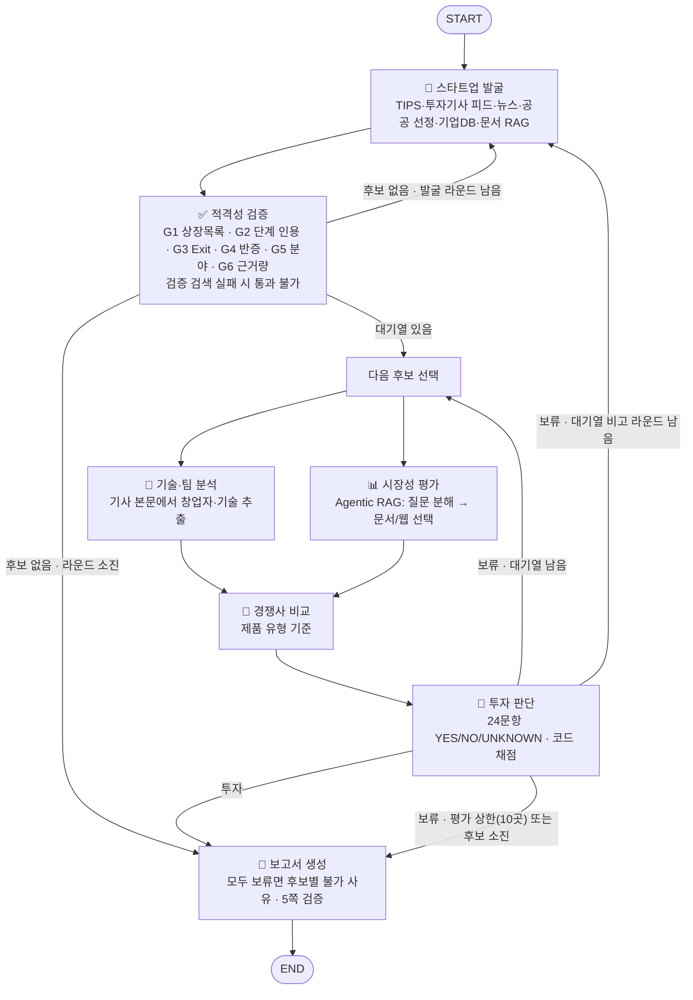
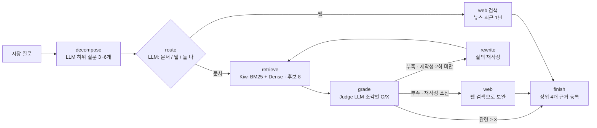

# AgTech AI 스타트업 투자 평가 에이전트 — 설계 산출물

> SKALA 울산캠퍼스 2반 1조 · 김가연 · 김진녕 · 문지후 · 이준희 · 정승우 · 작성일 2026-09-30
> 평가표·문서 목록·평가 결과 표와 State 표의 타입·설명 칸은 저장소의 `rubric.yaml`, `data/manifest.yaml`, `graph/state.py`, `outputs/eval/` 에서 자동으로 채웠다(설계와 코드가 어긋나지 않게). State 표의 쓰는/읽는 노드 칸과 본문 설명은 코드를 읽고 사람이 썼다.

## 목차

1. [도메인 선정과 문제 정의](#1-도메인-선정과-문제-정의)
2. [설계](#2-설계)
    - 2.1 에이전트 정의
    - 2.2 스타트업 발굴 전략 (가장 어려운 부분)
    - 2.3 RAG 적용 대상과 문서 선정 전략
    - 2.4 임베딩 모델 선정 (후보·기준·실측)
3. [투자 판단 기준 (평가표)](#3-투자-판단-기준-평가표)
4. [그래프 설계](#4-그래프-설계)
    - 4.1 State 설계
    - 4.2 Graph 흐름 (Workflow · Branch · Loop)
    - 4.3 Agentic RAG 서브그래프
5. [투자 보고서 목차 (초안)](#5-투자-보고서-목차-초안)
6. [설계를 코드로 옮긴 위치](#6-설계를-코드로-옮긴-위치)

**용어 정리**

| 용어 | 뜻 |
|---|---|
| 관문(Gate) | 평가 전에 과제의 스타트업 조건(비상장·Seed~C·Exit 전·AgTech AI)을 확인하는 통과/탈락 검사 |
| YES / NO / UNKNOWN | 평가 문항 판정. YES·NO 는 근거 원문 인용이 있어야 하고, 근거를 못 찾으면 UNKNOWN(0점) |
| Hit@K | 정답 조각이 검색 결과 앞 K개 안에 있는 질문의 비율 |
| MRR@K | 정답 조각 순위의 역수 평균(1위=1, 2위=0.5 …, K위 밖=0). 순위가 앞일수록 높다 |
| RRF | 여러 검색기 순위를 합치는 방법(순위의 역수를 더함). 키워드 검색(BM25)과 의미 검색(Dense)을 섞을 때 쓴다 |
| Reducer | LangGraph State 에서 여러 노드가 같은 키에 쓸 때 덮어쓰지 않고 합치는 함수 |
| Deal-killer | 점수와 관계없이 보류시키는 조건 |
| 재현용 캐시(replay/) | 검색 결과·LLM 응답을 저장해 두어, 같은 코드를 다시 돌리면 같은 보고서가 나오게 하는 폴더 |

---

## 1. 도메인 선정과 문제 정의

### 1.1 왜 AgTech 인가
| 근거 | 내용 |
|---|---|
| 시장·정책 | 「스마트농업 육성 및 지원에 관한 법률」(2024 시행)과 제1차 스마트농업 육성 기본계획(2025~2029)으로 정책 수요가 분명하다 |
| 투자 흐름 | 2025년 글로벌 애그리푸드테크 투자는 162억 달러로 전년과 비슷했고(-3%, 후기 투자자는 신중), 한국은 크게 늘었다 (AgFunder 2026, 코퍼스 문서). 2~3년 전 과열 뒤 조정 국면이라 **옥석 가리기**가 더 중요하다 |
| 풀어야 할 문제 | 농가 고령화·인력난·기후 리스크로 자동화 수요가 크지만, 농가 ROI·다작기 실증·자본집약도 때문에 실패한 스타트업도 많다 → **"유망해 보이는 것"과 "투자할 만한 것"을 가르는 근거 기반 평가가 필요** |

### 1.2 문제 정의
> **국내외 비상장 AgTech AI 스타트업(Seed~Series C, Exit 전)을 공개 정보만으로 발굴·검증·평가해, 임원이 바로 읽을 수 있는 5쪽 이내의 투자 검토 보고서를 자동으로 만든다.**

- 평가 범위: AI·센서·로봇이 농업 **생산성**을 높이는 기업. 세부 분야 5개
  - `greenhouse` 스마트팜·시설원예 AI 환경제어
  - `diagnosis` 작물 생육·병해충 진단 AI
  - `robotics` 농업 로봇·자율주행 농기계
  - `livestock` 축산 AI(가축 건강·사양 관리)
  - `agdata` 농업 생산 데이터(생육·환경·수확 예측) AI

- 스타트업 기준(과제 조건): 비상장 · 투자 단계 Seed~Series C · M&A/IPO 등 Exit 미완료
- 조사 범위: 국내외. 검증 단계에 국내 12곳 + 해외 6곳 자리를 따로 두어 해외 후보가 순서에 밀려 빠지지 않게 한다.
- 결과물: 투자/보류 판단과 근거, 리스크, 한계를 담은 PDF 보고서. **모두 보류면 루프를 끝내고, 후보마다 왜 안 되는지를 중심으로 보고서를 구성한다**(5장 B안).
- 성공 기준(측정): 적격성 판정 정확도, 검색 Hit@K·MRR, 판정 인용 검증 통과율, 보고서 형식 검증(5쪽, SUMMARY 반쪽, REFERENCE 형식)

---

## 2. 설계

### 2.1 에이전트 정의
가이드의 에이전트 정의(안)을 출발점으로, **가장 어려운 "스타트업 탐색"을 발굴(재현율)과 검증(정밀도) 두 에이전트로 나눴다.** 에이전트마다 한 가지 책임만 가진다.

| 에이전트 | 한 가지 책임 | 주요 도구 | RAG | 출력 (State 키) |
|---|---|---|---|---|
| 🔭 스타트업 발굴 | 투자 단계가 드러나는 공개 신호에서 후보를 **많이** 모은다 | TIPS 공개 목록, 투자 기사 피드, 뉴스·공공 선정·기업 DB 검색, LLM 개체 추출 | O (문서 속 기업 사례·선정 기업) | `raw_candidates`, `seen` |
| ✅ 적격성 검증 | 과제의 스타트업 기준을 **관문(Gate)** 으로 걸러낸다 | 거래소 상장 목록 대조(코드), 투자·인수·폐업 검색, 인용 검증 | X | `screened`, `queue` |
| 🔬 기술·팀 분석 | 제품·핵심 기술·성숙도·특허·창업팀(대표·기술 책임자 이름과 이력)을 근거로 정리 | 회사 대상 검색 + **기사 본문**에서 창업자 문단 추출 | O (분야 기술 동향 기준선) | `tech` |
| 📊 시장성 평가 | 시장 규모·성장·수요·정책·도입 장벽을 공신력 있는 문서로 정리 | **Agentic RAG**: LLM 이 질문을 3~6개로 나누고 하위 질문마다 문서/웹 검색을 고름 | **O (주 사용처)** | `market`, `market_cache` |
| 🥊 경쟁사 비교 | 기술·팀이 주장한 차별점을 경쟁사와 비교해 검증 | **제품 유형** 기준 경쟁 검색 + 대상 기사에 이름이 나온 경쟁사 | X | `competition` |
| 🧮 투자 판단 | 평가표 24문항을 YES/NO/UNKNOWN 으로 판정, **점수와 결론은 코드가** 계산 | 후보가 모은 근거에 대한 문항별 재검색(BM25), 인용 검증 | △ (문서 코퍼스가 아닌 수집 근거를 재검색) | `scorecard`, `decision`, `evaluations` |
| 📝 보고서 생성 | 임원 보고용 PDF 작성과 **형식 검증** | 템플릿 렌더링, 쪽수·SUMMARY 높이 측정, REFERENCE 생성 | X | `report` |

가이드 안과 달라진 점: ① 탐색을 발굴+검증으로 분리 ② 기술 요약에 **팀 분석**을 합침(평가표 30% 가 창업자) ③ 기술·팀 분석과 시장성 평가는 서로 독립이라 **병렬 실행**.

### 2.2 스타트업 발굴 전략 (가장 어려운 부분)
**창업자(링크드인) 검색을 쓰지 않는다.** 교수님 지적대로 링크드인 팔로워 같은 지표는 가입한 날부터 쌓여 **창업 시점과 맞지 않는다.** 사람의 경력은 회사의 창업 시기·투자 단계·상장 여부도 알려 주지 않고, 로그인·약관 문제로 재현도 안 된다. 대신 **회사에 일어난 "날짜가 찍힌 공개 사건"** 을 모은다.

**창업자 평가도 창업 시점에 맞춘다**: ① 창업 시점을 먼저 고정한다 — TIPS 공개 목록의 설립일, 국민연금 사업장 최초 가입일(첫 고용). ② 창업 **이전** 경력만 F1(분야 경험)로 인정한다. ③ 창업 **이후** 성과는 날짜가 찍힌 사건(수상·선정·투자·출시)만, 평가일 기준 24개월 안의 것만 F3 로 인정한다.

| 채널 | 무엇을 주나 | 왜 유효한가 |
|---|---|---|
| T. TIPS 창업기업 공개 목록 | 설립일·선정연도·운영사 | TIPS 는 운영사가 먼저 투자해야 선정 → **Seed 급 투자 이력 보장** |
| W. 투자 기사 피드 (와우테일 애그테크) | 투자 유치 기사, 정확한 게시일 | 라운드 자체가 기사화됨 |
| A. 투자 유치 뉴스 (세부 분야 5개) | 시드·시리즈 라운드 | 단계·시점이 함께 잡힘 |
| B. 공공 선정 (A-벤처스, 스마트농업 우수기업) | 정부가 검증한 기업 | 초기 기업 풀 |
| C. 스타트업 DB 스니펫 | 설립일·투자 단계 | 직접 크롤링은 하지 않음(robots·차단 정책 준수) |
| D. 수상·전시, E. 문서 RAG, F. 해외 투자 뉴스 | 보완 채널 | 국내가 부족할 때 확장 |
| **국민연금 가입 사업장 내역** (공공데이터, 키 불필요) | 최초 가입일·현재 가입자 수·탈퇴 여부·최근 채용/퇴사 | 창업자가 아니라 **회사의 창업(첫 고용) 시기와 실제 인원**을 제3자 공공자료로 확인. 탈퇴면 폐업·휴업 신호(G4) |
| **기사 원문 수집** (키 불필요) | 근거 기사의 본문 전체와 원문 게시일 | 검색 스니펫에 없는 창업자 이력·실적·계약을 확보하고, 게시일을 원문 메타데이터로 바로잡음 |

- **교차 신호**: 서로 다른 채널에서 함께 잡힌 후보일수록 실재하고 활발한 기업 → 우선순위를 올린다.
- **관문(적격성 검증)**: G1 비상장(한국거래소 KIND 상장 목록과 코드로 대조) · G2 Seed~Series C(인용문이 "회사명+단계" 가 함께 있는 근거에서 확인될 때만) · G3 Exit 없음 · G4 반증 검색(폐업·회생·구조조정) + 국민연금 사업장 탈퇴 여부 · G5 분야(**AI 핵심이고 농업 생산성 기술일 때만**, 유통·중개·수산 양식·식품 가공 제외, 확인 불가면 탈락) · G6 **회사명이 나오는** 근거 3곳 이상·제3자 1곳 이상
- **확인 못 하면 통과시키지 않는다(fail-closed)**: 상장 목록을 못 불러오거나, 검증 검색·반증 검색(G3/G4)이 한도 초과 등으로 실패하면 "확인 불가"로 탈락시킨다. 실패한 검색은 보고서 한계점에 회사별로 적는다.
- **검증 자리 배분**: 국내 12곳 + 해외 6곳.
- **루프**: 대기열이 비면 표현을 바꿔 한 번 더 발굴(`max_discovery_rounds`=2). 심층 평가는 최대 10곳 — 반 공용 API 키 비용 관리를 위한 상한이다(후보 1곳 평가에 LLM 호출 약 25회). 상한에 걸려 평가하지 못한 적격 후보는 보고서에 이름과 함께 밝힌다.

**적격성 검증 정확도**

정답 라벨은 조사 단계에서 공개 기사·기업 DB를 근거로 만들었고, 줄마다 근거 문장을 적어 두었다(`data/eval/eligibility_*.jsonl`). 사람이 원문을 다시 대조하는 독립 검수는 하지 않았다. 지표는 **적격/부적격 판정(이진)의 정확도**이며, 투자 단계 추출이나 탈락 사유(어느 관문)가 정답과 같은지는 따로 재지 않았다.

| 버전 | 바꾼 점 | 정확도 | 정밀도 | 재현율 | 주요 오류 |
|---|---|---|---|---|---|
| v1 | 투자 뉴스 스니펫만으로 판정, AI·AgTech 여부를 true/false 로 강제 | 0.50 | 0.67 | 0.18 | 투자 기사에 AI 설명이 없다는 이유로 "AI 핵심 아님" 탈락 5건, 요약 기사에서 다른 회사의 "Pre-IPO"를 가져옴 |
| v2 | AI·AgTech 여부 3가지 값(YES/NO/UNKNOWN), 단계 인용문 요구, 투자 검색 강화(advanced) | 0.75 | 0.80 | 0.73 | 올바른 인용문도 완전 일치가 아니라 거부(제목+본문 혼합), 폐업·인수 누락 |
| v3 | 인용문 3-gram 80% 일치 + 같은 근거에 회사명·단계 표현 동시 존재 확인 | 0.90 | 0.85 | 1.00 | 과거 폐업(Iron Ox)·지분 인수(유라이크코리아)를 못 찾음 |
| v4 | 인수·폐업 검색을 news → general 로 변경 (news 색인은 최근 기사 위주, 실측) | **1.00** | **1.00** | **1.00** | 없음 (단, 같은 20개사로 고쳤으므로 과적합 가능성 있음) |
| v5 (현재) | 검증 검색 실패 시 탈락(fail-closed), G5 는 AI·농업 생산성 모두 YES 일 때만, G6 는 회사명이 나오는 근거만, 국민연금·기사 원문 근거 추가 | 0.95 | 1.00 | 0.91 | Agtonomy(독립 스타트업)를 "대기업 계열"로 잘못 탈락. 홀드아웃 10개사는 1.00 |

- 개선에 쓴 20개사 정확도 0.95, 개선에 쓰지 않은 10개사(홀드아웃, 해외 기업) 정확도 1.00 — 현재 코드로 측정.

### 2.3 RAG 적용 대상과 문서 선정 전략
**Agentic RAG 답변 품질 (LLM-as-a-Judge, 이진 판정, 질문 20개)**: Relevance 1.00 · Faithfulness 0.95 · Correctness 0.95 · 질의 재작성 20% · 웹 보완 20%
- Generator·Judge 모두 `gpt-4.1-mini` 다(공용 키 비용 때문에 mini 등급). 같은 모델이 자기 답을 후하게 볼 수 있어, 평가표 판정은 **인용문이 실제 원문에 있는지 코드로 검사**하고, 적격성은 정답 라벨과 대조해 보완한다.

- **적용 에이전트**: 시장성 평가(주), 기술·팀 분석(분야 기술 동향 기준선), 스타트업 발굴(문서 속 기업 사례). 가이드 조건 "RAG 여부 O 중 최소 1개"를 넘는다.
- **왜 시장성인가**: 시장 규모·성장률·정책은 공신력 있는 수치가 필요하고, 웹 검색은 유료 시장조사 홍보 페이지처럼 수치 편차가 큰 출처가 섞인다. 그래서 시장 수치는 공공 문서에서, 회사 고유 정보는 날짜가 붙은 웹 근거에서 가져온다.

**문서 선정 원칙**: ① 공공기관·연구기관·동료심사 논문 — 예외로 **AgFunder 2026(민간 투자 리포트, 65쪽)** 을 넣었다. 글로벌·국가별 AgTech 투자 추이를 연 단위로 주는 공개 자료가 이것뿐이다 ② 2023년 이후 ③ 최종본만, **발췌 없이 문서 전체** ④ 평가 후보가 몰린 세부 분야(로봇·시설원예·축산)에 기술·사업성 문서 배치 — 병해충 진단 분야 기준선 문서는 넣지 못했다(아래 빈 칸) ⑤ 이해상충 문서 제외(평가 후보 기업 소속 연구소장이 쓴 보고서 제외)

**웹 검색 기간 규칙**: 투자·실적·경쟁 뉴스는 최근 1년을 먼저 찾고 부족하면 기간 제한을 푼다. 설립·인수·폐업처럼 과거 사건을 확인하는 검색은 기간 제한 없이 찾는다. 평가 문항은 사건 날짜로 다시 거른다(실적·투자·시장 성장 문항은 평가일 기준 24개월).

| 문서 | 발행 | 연도 | 쪽 | 역할 |
|---|---|---|---|---|
| 제1차 스마트농업 육성 기본계획(2025~2029년) | 농림축산식품부 | 2025 | 43 | 정책 목표·지원 제도·시장 수치·진입 장벽 |
| 스마트 농업과 농업 부문 고용 현황 및 전망 | 한국농촌경제연구원 | 2024 | 16 | 기관별 스마트농업 시장 추정치 비교 |
| 애그테크, 선택 아닌 필수 - 주요국의 애그테크 산업 정책 동향을 중심으로 | KDI 경제교육·정보센터 | 2023 | 18 | 세계·국내 애그테크 시장, 주요국 정책 |
| 기술력과 현장 확산 성과를 갖춘 스마트농업 우수기업 15개사 최초 선정 | 농림축산식품부 | 2026 | 2 | 스타트업 발굴 시드(정부 선정 기업) |
| 농식품 분야 우수 벤처창업 기업 정보가 한 곳에 | 농림축산식품부 | 2024 | 2 | 스타트업 발굴 시드(이달의 A-벤처스) |
| 농식품 모태펀드, 2026년 신산업 투자 본격 확대 | 농림축산식품부 | 2026 | 2 | 국내 농식품 벤처 투자 자금 흐름 |
| 「스마트농업 육성 및 지원에 관한 법률」 제정의 의의와 향후 과제 | 국회입법조사처 | 2023 | 4 | 규제 프레임(스마트농업법) |
| '스마트농업 데이터 AX활용' 본격 추진 | 농림축산식품부 | 2026 | 3 | 2026 농업 AI 정책·데이터 인프라 |
| Global AgriFoodTech Investment Report 2026 | AgFunder | 2026 | 65 | 분야별 글로벌 투자 동향(국가별·단계별) |
| Precision Agriculture in the Digital Era: Recent Adoption on U.S. Farms (Report Summary) | USDA Economic Research Service | 2023 | 2 | 정밀농업 도입률·도입 장벽 |
| Precision Dairy Farming, Robotic Milking, and Profitability in the United States (Report Summary) | USDA Economic Research Service | 2026 | 2 | 축산 로봇·정밀 낙농 수익성 |
| Agricultural Robotics: A Technical Review Addressing Challenges in Sustainable Crop Production | MDPI | 2025 | 26 | 농업 로봇 기술 성숙도·확산 장벽 (로봇 후보 기준선) |
| Vertical farming economics: crop performance targets for cost-competitive vertical farming | Frontiers | 2026 | 11 | 수직농장·시설원예 사업성 리스크 (CEA 후보 기준선) |
| **합계** | | | **196** | 과제 한도 200쪽 |

**선정 과정 (후보 45개, 2,031쪽 → 13개, 196쪽)**: 공공·국제기구 공개 PDF 45개(국문 21·영문 24)를 내려받아 텍스트 추출 여부와 쪽수를 확인한 뒤 아래 이유로 뺐다.

| 제외 사유 | 대표 문서 |
|---|---|
| 200쪽 한도에 비해 너무 김 (발췌 대신 전체 사용 원칙) | KREI 미래농업 신성장 산업(209쪽), FCDO AI 농식품 리뷰(188쪽), World Bank AI 보고서(102쪽), JRC 디지털화(105쪽) |
| 이해상충 | IPET 무인 농작업 협업 기술 — 평가 후보 기업(긴트) 연구소장이 집필 |
| 오래됨 (2022년 이전) · 내용 중복 | FAO-ITU AI in Agriculture(2021), AgFunder 2025(2026판과 중복), 요약본이 있는 원문 |
| 평가 대상과 거리가 멂 | 식품테크 투자(Dealroom), 인도 농업 AI(WEF), 드론·유통 심층 보고서 |
| 수치 출처 문제 | 같은 시장 수치를 다른 시장으로 옮겨 적은 보고서 (IPET 축산 AX: 스마트농업 전체 시장 수치를 축산 시장으로 인용) |

**에이전트 질문과 문서 커버리지**

| 에이전트 질문 | 대응 문서 |
|---|---|
| 국내 시장 규모·기관별 추정치 | KREI 스마트농업과 고용, KDI 애그테크 리뷰, 농식품부 기본계획 |
| 글로벌 시장·투자 동향 | AgFunder 2026, KDI 애그테크 리뷰 |
| 정책·규제 | 농식품부 기본계획, 국회입법조사처 스마트농업법, 데이터 AX 보도자료 |
| 도입 장벽·수익성 | USDA 정밀농업 도입, USDA 로봇 착유 수익성, 수직농장 경제성 논문 |
| 기술 기준선 | 농업 로봇 기술 리뷰(로봇·수확), 수직농장 경제성(시설원예), USDA 로봇 착유(축산) |
| 스타트업 발굴 시드 | 스마트농업 우수기업 15개사, A-벤처스 60개사, 농식품 모태펀드 |

빈 칸: 병해충 진단·농업 데이터 분야의 기술 기준선 문서는 200쪽 한도 때문에 넣지 못했다(해당 분야 후보는 웹 근거로 평가).

**전처리** (실습에서 겪은 오류를 반영): 매 페이지 반복되는 머리글·바닥글 제거 · **출처·각주 줄을 본문에서 분리**(출처 줄의 날짜를 사건 날짜로 오인한 경험) · 2단 편집은 단 순서로 읽기 · 표는 캡션과 묶어 별도 조각(장식 박스 오탐 필터) · 참고문헌 페이지 제외 · 조각 800자 / 겹침 100자

**검색**: Kiwi 형태소 BM25 0.4 + Dense 0.6 (RRF) → 후보 8개 → Judge LLM 관련성 O/X → 최종 4개 (가중치·방식은 2.4 실측으로 결정)

### 2.4 임베딩 모델 선정 (후보·기준·실측)
**리더보드 순위로 고르지 않았다.** 공개 한국어 검색 벤치마크에서 상위 모델 간 차이는 nDCG@10 1.5%p 이내라(KURE 공개 벤치마크) 문서 종류에 따라 순위가 바뀔 수 있다. 그래서 우리 문서로 직접 재서 골랐다. 과제 조건대로 **경제성**을 먼저 봤다: 모든 후보가 로컬에서 도는 오픈소스라 임베딩 API 비용은 0원이다.

**후보를 고른 기준 (과제 조건에서 출발)**

| 기준 | 이유 | 판정 |
|---|---|---|
| C1 한·영 혼용 | 한국 보고서 + 영문 보고서 코퍼스 | 한국어 검색 학습 또는 다국어 검색 학습 |
| C2 최대 길이 ≥ 조각 길이 | 800자 한국어 조각은 최대 약 700토큰 | 128토큰 모델은 100% 잘려 제외 |
| C3 노트북 재현성 | 팀원 노트북, GPU 없음 | GPU 없이 동작, 문서 임베딩은 한 번만 계산해 캐시 |
| C4 라이선스 | 오픈소스 조건, 결과 공개 | MIT/Apache 명시 (미기재 모델 제외) |
| C5 입력 규칙 위험 | 접두어를 빠뜨리면 조용히 성능 저하 | 규칙을 코드에 명시 |

**최종 비교 후보 6개**: bge-m3(다국어 기준선) · KURE-v1(bge-m3 한국어 미세조정) · snowflake-arctic-embed-l-v2.0-ko(행정·금융 문서 기계독해로 한국어 미세조정) · multilingual-e5-large(평균 풀링 계열 대조군) · Qwen3-Embedding-0.6B(디코더 기반 대안) · multilingual-e5-small(저사양 노트북 대안)
제외: ko-sroberta·MiniLM(128토큰 한계, 검색용 아님), upskyy/bge-m3-korean(라이선스 미기재), BGE-m3-ko(KURE 와 같은 가설·학습 데이터 미기재)

**1차 실측 (임베딩 6종 × 검색 방식, 질문 70개 = 자연어형 40 + 키워드형 30, 정답 = 같은 문서·페이지, 두 세트 평균)**

| retriever      | embedding                        |   Hit@1 |   Hit@3 |   Hit@5 |   MRR@5 |
|:---------------|:---------------------------------|--------:|--------:|--------:|--------:|
| Dense          | nlpai-lab/KURE-v1                |   0.8   |   0.938 |   0.971 |   0.868 |
| Dense          | snowflake-arctic-embed-l-v2.0-ko |   0.771 |   0.954 |   0.971 |   0.864 |
| Hybrid 0.3:0.7 | nlpai-lab/KURE-v1                |   0.708 |   0.962 |   0.988 |   0.832 |
| Dense          | BAAI/bge-m3                      |   0.734 |   0.929 |   0.958 |   0.831 |
| Hybrid 0.3:0.7 | BAAI/bge-m3                      |   0.716 |   0.938 |   0.975 |   0.82  |
| Hybrid 0.3:0.7 | snowflake-arctic-embed-l-v2.0-ko |   0.708 |   0.929 |   0.971 |   0.82  |
| Dense          | Qwen/Qwen3-Embedding-0.6B        |   0.704 |   0.904 |   0.942 |   0.803 |
| Dense          | multilingual-e5-large            |   0.684 |   0.85  |   0.866 |   0.763 |
| Hybrid 0.5:0.5 | nlpai-lab/KURE-v1                |   0.6   |   0.934 |   0.958 |   0.762 |
| Hybrid 0.3:0.7 | Qwen/Qwen3-Embedding-0.6B        |   0.629 |   0.875 |   0.958 |   0.76  |
| Hybrid 0.5:0.5 | snowflake-arctic-embed-l-v2.0-ko |   0.596 |   0.904 |   0.942 |   0.746 |
| Hybrid 0.3:0.7 | multilingual-e5-large            |   0.659 |   0.788 |   0.884 |   0.741 |
| Hybrid 0.5:0.5 | BAAI/bge-m3                      |   0.587 |   0.879 |   0.946 |   0.739 |
| Hybrid 0.5:0.5 | Qwen/Qwen3-Embedding-0.6B        |   0.612 |   0.838 |   0.904 |   0.726 |
| Hybrid 0.5:0.5 | multilingual-e5-large            |   0.612 |   0.788 |   0.854 |   0.712 |
| Kiwi BM25      | -                                |   0.6   |   0.675 |   0.721 |   0.644 |
| Hybrid 0.5:0.5 | multilingual-e5-small            |   0.542 |   0.729 |   0.729 |   0.624 |
| Dense          | multilingual-e5-small            |   0.504 |   0.638 |   0.666 |   0.575 |
| Hybrid 0.3:0.7 | multilingual-e5-small            |   0.496 |   0.654 |   0.666 |   0.571 |

**2차: 실제 파이프라인 설정으로 다시 측정해 결정**

처음에는 "Judge LLM 이 후보 8개를 다시 거르니 순위보다 8개 안 적중(Hit@8)이 중요하다"고 보고 snowflake-arctic-ko + 하이브리드 0.3:0.7 을 골랐다. 그런데 코드는 관련 판정을 받은 조각을 **검색 순서대로 앞 4개만** 쓴다. 그래서 측정 기준을 실제 동작에 맞춰 **Hit@4(앞 4개 안 적중)와 MRR@4** 로 바꾸고, 측정 전에 규칙을 정했다(`eval/eval_final_retriever.py` 머리말).

1. 전체 Hit@4 가 가장 높은 설정
2. 같으면 MRR@4 가 높은 설정
3. 다른 임베딩이 1위여도, 지금 쓰는 임베딩의 최고 설정이 두 지표 모두 0.01 이내면 재색인이 필요 없는 쪽

- 결과: **KURE-v1 + 하이브리드 0.4:0.6** 이 Hit@4 0.986(70문항 중 69), MRR@4 0.833 으로 1위다. 처음 고른 설정은 Hit@4 0.943 으로 3문항을 더 놓쳤다. 재색인 없이 가능한 최고(snowflake Dense 단독, Hit@4 0.971)는 규칙 3의 0.01 범위 밖이라 임베딩을 바꿨다.
- 가중치 민감도: KURE-v1 하이브리드는 BM25 0.1~0.4 에서 Hit@4 가 모두 0.986 이고 MRR@4 차이도 0.013 이내다. 가중치 하나에 기대는 결과가 아니다. 0.5:0.5 는 영어 문서의 1위 적중이 0.148 로 떨어져 가장 나빴다. 가중치보다 임베딩 선택의 효과가 컸다.
- 하이브리드를 쓰는 이유: 같은 KURE-v1 에서 Dense 단독은 Hit@4 0.943 이다. 키워드 검색(BM25)이 회사명·정책명 같은 정확한 용어가 들어간 키워드형 질문을 보완한다(키워드형 Hit@4 0.900 → 1.000).
- 한계: 질문 70개라 1문항 차이가 0.014 다. 차이가 작으므로 검색 평가 질문을 늘리는 것이 다음 과제다. 질문은 LLM 으로 만든 뒤 LLM 으로 걸렀고 사람이 전수 검수하지는 않았다.

| 설정 (후보 8개) | Hit@1 | Hit@3 | **Hit@4** | **MRR@4** | Hit@8 | 한국어 문서 Hit@4 | 영어 문서 Hit@4 |
|---|---|---|---|---|---|---|---|
| snowflake + 하이브리드 0.3:0.7 (처음 선택) | 0.700 | 0.929 | 0.943 | 0.808 | 0.971 | 1.000 | 0.852 |
| snowflake Dense | 0.771 | 0.957 | 0.971 | 0.865 | 0.971 | 1.000 | 0.926 |
| snowflake + 하이브리드 0.5:0.5 | 0.586 | 0.900 | 0.929 | 0.736 | 0.986 | 1.000 | 0.815 |
| KURE-v1 Dense | 0.800 | 0.943 | 0.943 | 0.864 | 0.986 | 0.953 | 0.926 |
| KURE-v1 + 하이브리드 0.3:0.7 | 0.700 | 0.957 | 0.986 | 0.826 | 0.986 | 1.000 | 0.963 |
| **KURE-v1 + 하이브리드 0.4:0.6 (선택)** | 0.714 | 0.957 | 0.986 | 0.833 | 0.986 | 1.000 | 0.963 |
| KURE-v1 + 하이브리드 0.5:0.5 | 0.586 | 0.929 | 0.957 | 0.752 | 0.986 | 1.000 | 0.889 |
| Kiwi BM25 단독 | 0.586 | 0.657 | 0.686 | 0.624 | 0.700 | 0.953 | 0.259 |

표의 수치는 질문 70개 기준이며 1문항 = 0.014. 한국어/영어는 정답 문서의 언어다(질문은 모두 한국어).

**선정**: `nlpai-lab/KURE-v1` + 하이브리드(Kiwi BM25 0.4 : Dense 0.6), 후보 8개 → Judge O/X → 앞 4개. MIT 라이선스, 최대 8,192토큰(우리 조각 800자보다 충분히 김), 질의 접두어 없음(설정 파일에 명시).

---

## 3. 투자 판단 기준 (평가표)

**틀**: 과제의 Scorecard 가중치(창업자 30 / 시장성 25 / 제품·기술력 15 / 경쟁 우위 10 / 실적 10 / 투자조건 10) 안에 **Bessemer 체크리스트 10문항을 모두 배치**하고, AgTech 투자에서 반복되는 실패 요인을 문항으로 넣었다. 실패 요인의 근거는 코퍼스 문서다: 농가 도입 장벽·수익성(USDA 정밀농업 도입, USDA 로봇 착유 수익성), 자본집약도(수직농장 경제성 논문), 검정·인증 제도(제1차 스마트농업 육성 기본계획).

**공개 정보 기준으로 다시 해석한 항목**: 투자조건(Deal Terms)의 밸류에이션·지분율은 비상장 초기 기업이 거의 공개하지 않는다. 그래서 공개된 최근 라운드·기관투자자 참여로 대신 재고, 밸류에이션(D3)은 확인되지 않으면 실사 항목으로 넘긴다. 같은 이유로 투자 수익률(ROI)은 계산하지 않는다 — 가격 정보 없이 만든 ROI 는 근거 없는 숫자가 되기 때문이다. Bessemer 의 "다음 10년을 쏟을 각오"는 공개 정보로 직접 잴 수 없어, 창업 이전부터 같은 분야에 있었는지(F1)로 대신 본다는 한계가 있다.

**판정 방식**: 1~5점 척도 대신 **YES / NO / UNKNOWN** (N/A 는 인허가 문항만)
- YES 는 근거 원문 인용이 있어야 하고, **코드가 인용문이 실제 근거 본문에 있는지 검사**한다 (실패하면 UNKNOWN)
- NO 도 반대 사실을 적은 문장의 인용이 본문에 있어야 한다. "근거가 없다"는 NO 가 아니라 UNKNOWN 이다 (없음과 반대를 구분)
- 회사 고유 문항은 근거에 **회사명**이 있어야, 성능·경제성 문항은 **제3자 근거**가(기사에 실렸어도 대표 발언·회사 계획이면 제3자 근거가 아님), 실적·투자·시장 성장 문항은 **최근 24개월** 근거가 있어야 한다(문서는 발행 연도로 판단)
- "상용화 예정·실증·시범 운영"은 상용 운영이 아니다. 투자 금액이 "비공개"면 라운드 문항(D1)을 인정하지 않는다
- UNKNOWN 은 0점, 분모를 줄이지 않는다 (정보를 감춘 회사가 유리해지지 않게)
- LLM 에는 점수·기준점을 보여 주지 않고, **항목별로 따로** 판정시킨다 (후광 효과 방지)

**창업자·팀 (Owner) — 30점** (문항당 7.5점)

| ID | 질문 | YES 요건 | Bessemer 연결 |
|---|---|---|---|
| F1 | 창업자나 경영진이 창업 이전부터 농업 현장이나 해당 기술 분야에서 연구·실무·사업 경험을 쌓았는가? (농학·축산·수의·원예 전공, 관련 연구·실무, 이전 창업 등) | 이름과 경력이 함께 적힌 근거 | 창업자와 팀은 이 분야에서 믿을 만한가 / 창업자가 다음 10년을 이 분야에 쏟을 각오가 있는가(대리지표) |
| F2 | 핵심 기술(AI·로봇·센서) 책임자의 기술 이력(특허 발명자, 논문, 연구소·기업 경력)이 확인되는가? | 기술 책임자 개인의 특허·논문·연구·경력이 적힌 근거 (회사 기술 소개나 출신 학교만으로는 부족) | 창업자와 팀은 이 분야에서 믿을 만한가 |
| F3 | 최근 24개월 안에 공개된 마일스톤(제품 출시, 현장 설치, 인증, 정부 과제·TIPS 선정, 후속 투자)이 2건 이상 있는가? | 날짜가 있는 마일스톤 근거 2개 이상 (투자 유치·수상·정부 선정·혁신상·우수기업 선정·출시·인증) | (실행력) |
| F4 | 회사가 공개한 핵심 수치(고객 수·성능·매출 등)가 제3자 근거로도 확인되는가? 서로 모순되는 근거가 있으면 NO | 같은 수치를 확인한 제3자 근거 (모순 근거가 있을 때만 NO) | (커뮤니케이션·신뢰) |

**시장성 (Opportunity Size) — 25점** (문항당 6.25점)

| ID | 질문 | YES 요건 | Bessemer 연결 |
|---|---|---|---|
| M1 | 목표 시장(해당 세부 분야 또는 스마트농업·애그테크 시장)의 규모가 공공기관·국제기구·연구기관 문서에서 수치와 기준 연도로 확인되는가? | 문서 코퍼스 근거([D...]) 필수 | 이 시장은 얼마나 큰가 |
| M2 | 해당 분야가 성장 중이라는 최근 근거(투자액·도입률·정책 예산 증가)가 있는가? | 발행 연도가 있는 수치 (평가일 기준 최근 2년 안에 발행된 근거) | 이 스타트업이 성공한다면 정말 큰 기회가 될까 |
| M3 | 고객의 실제 문제와 제품의 경제적 효과(비용 절감, 수확량 증가, 노동 절감)가 수치로 제시되고 제3자 근거가 있는가? | 제3자 출처의 효과 수치 | 제품이 시장의 실제 문제를 해결하는가 |
| M4 | 누가 돈을 내는지와 과금 방식(장비 판매, 구독, 서비스, 수수료, 공공 조달)이 확인되는가? | 과금 방식을 서술한 근거 | 고객이 실제로 이 제품에 비용을 지불할 이유가 있는가 / 수익 모델은 명확한가 |

**제품/기술력 — 15점** (문항당 3.75점)

| ID | 질문 | YES 요건 | Bessemer 연결 |
|---|---|---|---|
| P1 | 시제품 단계를 지나 실제 농장·온실·축사에서 상용으로 운영 중인가? | 설치 수·면적·두수·고객명 중 하나 이상 (상용화 예정·실증·PoC·시범 운영은 상용 운영이 아님) | (구현 가능성) |
| P2 | 성능이 여러 작기(연도) 또는 여러 지역의 현장 실증으로 제시되는가? | 공공기관·대학·지자체 등 제3자 실증 근거 | (검증) |
| P3 | 핵심 기술이 자체 개발임을 보여 주는 근거(자사 특허·논문, 자체 데이터셋, 자체 하드웨어)가 있는가? | 자체 개발 근거 | 경쟁사보다 뚜렷한 차별성이 있는가 |
| P4 | 제품 유형상 필요한 인허가·검정(농업기계 검정, 농약·비료·동물용 의약품 등록 등)을 받았거나 신청했는가? 대상이 아니면 N/A | 회사 제품의 검정·등록·인증 사실 (정부의 기준 마련·정책 기사는 회사 인허가 근거가 아님) 또는 N/A 사유 | 기술, 운영, 법률적 리스크는 무엇인가 |

**경쟁 우위 — 10점** (문항당 2.5점)

| ID | 질문 | YES 요건 | Bessemer 연결 |
|---|---|---|---|
| C1 | 핵심 기술 관련 특허(등록 또는 출원)가 1건 이상 확인되는가? (초기 기업이라 출원도 인정, 보고서에 등록·출원 구분 표기) | 특허 근거 | (진입장벽) |
| C2 | 국내외 경쟁사 2곳 이상과 비교했을 때 구체적인 차별점(성능·가격·적용 작목·범위)이 근거로 확인되는가? | 경쟁사 비교 근거 | 경쟁사 보다 뚜렷한 차별성이 있는가 |
| C3 | 사용이 늘수록 자체 데이터가 쌓여 성능이 좋아지거나, 설치·연동 때문에 교체 비용이 드는 구조인가? | 데이터 축적·연동 구조 근거 | (네트워크 효과) |
| C4 | 유통·전략 파트너(농협, 농기계·농자재 기업, 지자체, 대형 유통, 해외 파트너)와 계약이나 공동사업이 있는가? (MOU 만 있으면 NO) | 계약 상대방이 적힌 근거 | (파트너) |

**실적 — 10점** (문항당 2.5점)

| ID | 질문 | YES 요건 | Bessemer 연결 |
|---|---|---|---|
| R1 | 연도가 적힌 매출액이 기업 DB·공시·보도로 확인되는가? | 매출 금액과 연도 (투자 유치 금액은 매출이 아님) | (매출) |
| R2 | 유료 고객이나 설치 규모(고객 수, 농가 수, 면적, 두수, 계약 금액)가 수치로 확인되는가? | 수치 | 초기 고객의 반응은 어떠한가 |
| R3 | 같은 고객의 재계약·확대 도입이나 여러 해 연속 사용 근거가 있는가? | 재사용 근거 | 초기 고객의 반응은 어떠한가 |
| R4 | 정부 보조사업이 아닌 매출(민간 판매, 수출, 기업 간 계약) 근거가 있는가? | 민간·수출 판매 근거 | (보조금 의존도) |

**투자조건 (Deal Terms) — 10점** (문항당 2.5점)

| ID | 질문 | YES 요건 | Bessemer 연결 |
|---|---|---|---|
| D1 | 최근 24개월 안의 투자 라운드 단계·금액·시점이 공개 근거로 확인되는가? | 단계·금액·시점이 적힌 근거 | (자금 조달) |
| D2 | 최근 라운드에 기관투자자(VC, CVC, 정책 펀드, TIPS 운영사)가 참여했는가? | 투자사 이름 | (투자 조건의 적절성) |
| D3 | 기업가치(Valuation) 또는 투자 지분율이 공개 근거로 확인되는가? | 수치 근거 (비공개면 UNKNOWN, 보고서에 실사 필요로 표기) | (Valuation·지분율) |
| D4 | 상업화 전에 대규모 자체 시설(대형 수직농장 등)이 필요 없는 모델이거나, 필요하다면 전략적 투자자·비희석 자금을 확보했는가? | 사업 모델·자금 구조 근거 | 기술, 운영, 법률적 리스크는 무엇인가 |

**관문 (평가 전 차단)**

| ID | 관문 |
|---|---|
| G1 | 비상장 — 한국거래소 상장 목록과 코드로 대조, 해외는 뉴스 근거 |
| G2 | 최근 투자 단계 Seed~Series C (근거 id 필수, 확인 불가면 탈락) |
| G3 | Exit(M&A·IPO) 완료 없음 — '추진'은 통과 |
| G4 | 최근 24개월 중대한 부정 신호 없음 (회생·파산·폐업·사업 중단·창업자 이탈·분쟁·제재) — 반증 검색 1회 |
| G5 | AI·센서·로봇이 농업 생산성 향상의 핵심 (배달·유통만 하는 기업, 상장사·대기업 계열 제외) |
| G6 | 최소 근거량 — 서로 다른 출처 3곳 이상, 그중 1곳 이상은 회사 자체 발표가 아닌 제3자 출처 |

**Deal-killer (점수와 관계없이 보류)**

| ID | 조건 | 내용 |
|---|---|---|
| K1 | P4=NO | 판매 중인데 필수 인허가·검정 미취득 |
| K2 | C1=NO C2=NO | 특허도 없고 경쟁사 대비 차별점도 없음 (쉽게 복제 가능) |
| K3 | F4=NO | 회사 공개 수치가 제3자 근거와 모순 (신뢰 문제) — 모순 근거가 있을 때만 NO |

**최종 판단**: 투자 ⇔ 총점 ≥ 70 AND 창업자 통과율 ≥ 50% AND 시장성 통과율 ≥ 50% AND Deal-killer 없음 AND UNKNOWN 비율 ≤ 40%. 그 외는 보류(사유: 점수 미달 / 핵심 항목 미달 / Deal-killer / 정보 부족). 70점은 원 방법론에서 나온 값이 아닌 설계 가정이므로 60·70·80점 민감도를 함께 기록한다.

---

## 4. 그래프 설계

### 4.1 State 설계

State 는 데이터를 담는 그릇이라기보다 **에이전트 사이의 인터페이스 규격**으로 설계했다. 키마다 누가 쓰고 누가 읽는지를 정하고, 각 노드는 바꾼 키만 딕셔너리로 돌려준다. Reducer 가 없는 키는 덮어쓰고, 다음 에이전트가 이어 써야 하는 키만 누적한다.

| 키 | 타입 (Reducer) | 쓰는 노드 | 읽는 노드 | 설명 |
|---|---|---|---|---|
| `domain` | str | app | 없음 (실행 기록용, 에이전트는 config 를 읽음) | "AgTech" |
| `run_date` | str | app | verify · decide(24개월 판정) · report(작성일) | 실행일 (YYYY-MM-DD), 근거 조회일로도 쓴다 |
| `registry` | dict (reducer: merge_dict) | 모든 에이전트 | 모든 에이전트 (근거 인용·REFERENCE) | 근거 저장소 {근거 id: 문서·웹 메타데이터} |
| `discovery_rounds` | int | discover | 라우터(발굴 반복 상한) | 발굴 라운드 수 (max_discovery_rounds 로 제한) |
| `raw_candidates` | list[dict] | discover | verify | 이번 라운드 발굴 후보 (이름, 분야, 발굴 채널, 근거 id) |
| `seen` | list[str] (reducer: add_unique) | discover | discover(중복 발굴 방지) | 이미 다룬 후보의 정규화 이름 (중복 발굴 방지) |
| `screened` | list[dict] (reducer: operator.add) | verify | report(선정 과정·미평가 후보) | 적격성 판정 기록 전체 (통과·탈락 사유) |
| `queue` | list[dict] | verify · select | select · 라우터 | 적격 판정 후 우선순위 순으로 정렬된 평가 대기열 |
| `current` | dict | select | tech · market · competition · decide | 후보 프로필 (이름, 투자 단계, 설립연도, 근거 id) |
| `tech` | dict | tech | competition · decide | 기술·팀 분석 결과 — 후보가 바뀔 때 select 가 초기화 |
| `market` | dict | market | decide | 시장성 평가 결과 — 후보가 바뀔 때 select 가 초기화 |
| `market_cache` | dict (reducer: merge_dict) | market | market(같은 분야 재사용) | 세부 분야별 시장 분석 캐시 (같은 분야 재분석 방지) |
| `competition` | dict | competition | decide | 경쟁사 비교 결과 — 후보가 바뀔 때 select 가 초기화 |
| `scorecard` | dict | decide | 없음 (report 는 evaluations 안의 후보별 사본을 읽음) | 평가표 24문항 판정(YES·NO·UNKNOWN), 점수, 판단 — 후보가 바뀔 때 select 가 초기화 |
| `iterations` | int | select | 라우터(평가 상한) | 심층 평가한 후보 수 (max_evaluations 로 제한) |
| `evaluations` | list[dict] (reducer: operator.add) | decide | report(후보별 사유·최고점 상세) | 후보별 최종 평가 요약 (보고서 비교표에 사용) |
| `decision` | str | decide | 라우터(투자면 보고서) | 마지막 판단: 투자 또는 보류 |
| `report` | dict | report | app(run_log) | 보고서 파일 경로, 페이지 수, 검증 결과 |
| `rag_traces` | list[dict] (reducer: operator.add) | discover · tech · market | app(run_log) | Agentic RAG 수행 기록 (재작성·웹 보완 여부) |
| `log` | list[str] (reducer: operator.add) | 모든 노드 | app(run_log) | 진행 기록 |

병렬로 실행되는 기술·팀 분석과 시장성 평가가 같은 키를 동시에 갱신해도 안전하도록, 누적 키(`registry`, `screened`, `evaluations`, `log` 등)에 Reducer 를 붙였다. 근거 id 는 순번이 아닌 **URL·문서 해시**로 만들어 병렬 등록에도 충돌하지 않는다.

### 4.2 Graph 흐름 (Workflow · Branch · Loop)

| 분기 지점 | 조건 | 다음 노드 |
|---|---|---|
| verify 뒤 | 평가 대기열에 후보 있음 | select |
| verify 뒤 | 대기열 비었고 발굴 라운드 남음 | discover (재발굴) |
| verify 뒤 | 대기열 비었고 발굴 라운드 소진 | report (평가한 후보가 없으면 "적격 후보 없음" 보고서) |
| decide 뒤 | 투자 | report |
| decide 뒤 | 보류 · 평가 상한(10곳) 도달 | report (공용 키 비용 상한. 남은 적격 후보는 보고서에 "미평가"로 밝힘) |
| decide 뒤 | 보류 · 대기열 남음 | select (다음 후보) |
| decide 뒤 | 보류 · 대기열 비었고 발굴 라운드 남음 | discover (가이드: 보류면 다른 스타트업 탐색) |
| decide 뒤 | 보류 · 후보 소진 | report (모두 보류: 루프 종료 후 보고서) |

무한 루프 방지: 발굴 라운드 상한 2, 심층 평가 상한 10, Agentic RAG 재작성 상한 2, LangGraph recursion_limit 100.

### 4.3 Agentic RAG 서브그래프

두 단계다. ① **에이전트가 판단하는 부분(시장성 평가)**: LLM 이 분야의 시장 질문을 하위 질문 3~6개로 나누고(질의 분해), 하위 질문마다 문서 검색·웹 검색·둘 다 중 무엇을 쓸지 이유와 함께 고른다(라우팅). 이 결정은 실행 기록(`run_log.json` 의 rag_traces)에 남는다. ② **교정형 검색(Corrective RAG) 서브그래프**: 문서 검색 결과를 Judge LLM 이 조각별로 O/X 채점하고, 관련 조각이 3개보다 적으면 질의를 다시 쓰고(최대 2회), 그래도 부족하면 웹 검색으로 보완한다. 관련 조각은 검색 순위대로 앞 4개만 쓴다. 기술·팀 분석과 스타트업 발굴도 ② 서브그래프를 부른다.

---

## 5. 투자 보고서 목차 (초안)

평가 결과에 따라 목차가 두 벌이다. 투자 권고 대상이 있으면 A안, 모두 보류면 B안으로 만든다(교수님 안내: 모두 안 되면 그 이유들로 보고서를 구성). 두 안 모두 맨 앞 SUMMARY, 맨 뒤 REFERENCE, 전체 5쪽 이내다.

**B안 — 모두 보류일 때**

| 순서 | 장 | 담는 내용 | 형식 규칙 |
|---|---|---|---|
| 0 | **SUMMARY** | 상황(몇 곳을 찾아 몇 곳을 평가했나) → 결론(투자 권고 없음) → 공통 원인 → 요청·재검토 조건 | A4 절반 이내, 개요 문장 금지, 결론 줄은 코드가 작성(평가 상한으로 못 본 후보가 있으면 그 수도 적음) |
| 1 | 후보 풀과 선정 과정 | 발굴 → 검증 → 적격 → 심층 평가 수(국내/해외), 적격이지만 평가하지 못한 후보와 이유 | 표는 코드가 생성 |
| 2 | 후보별 보류 사유 | 후보마다 사업 한 줄, 대표·설립일, 결정적인 반대 근거와 확인되지 않은 핵심 항목, 재검토 조건 | 근거 번호 인용 |
| 3 | 최고점 후보 상세 | 사업 아이디어·수익 방식, 시장 규모와 성장성, 기술력과 팀, 경쟁 구도 표, 사업 리스크(시장·기술·규제·경쟁) | 경쟁사 표·리스크 표에도 근거 번호 |
| 4 | 투자 판단 요약 | 후보별 항목 점수·총점·UNKNOWN 비율, 최고점 후보의 결정적 문항(최대 6개) | 24문항 전체는 `outputs/run_log.json` 에 둠 |
| 5 | 한계점 | 검색 실패(회사별), 미평가 후보, 방법론 한계 | 2~4개 |
| 6 | **REFERENCE** | 본문에 실제로 인용된 자료만, **기관 보고서 / 학술 논문 / 웹페이지** 로 나눠 적음 | 아래 A안과 같은 표기 형식 |

**A안 — 투자 권고 대상이 있을 때**

| 순서 | 장 | 담는 내용 | 형식 규칙 |
|---|---|---|---|
| 0 | **SUMMARY** | 상황 → 결론 → 핵심 근거 → 조건 (4줄) | A4 **절반 이내**(렌더링 후 높이 측정), "이 보고서는 ~" 같은 개요 문장 금지(금지어 검사), **결론 줄은 코드가 평가 결과로 작성** |
| 1 | 사업 아이디어 | 해결하는 문제, 제품, 수익 방식, 투자 단계 | 근거 번호 인용 |
| 2 | 시장 규모와 성장성 | 국내·글로벌 규모(기준 연도), 성장률, 수요 요인, 정책 | 공공 문서 우선, 추정 기관 명시 |
| 3 | 기술력과 팀 | 핵심 기술, 성숙도, 차별점, 특허, 창업자·핵심 인력 | 확인 불가 항목은 그대로 밝힘 |
| 4 | 경쟁 구도 | 경쟁사 3~5곳 비교표, 실제 차별성, 진입장벽 | 표는 코드가 생성 |
| 5 | 사업 리스크 | 시장·기술·규제·경쟁 리스크와 완화 방안 | 유형별 1개 이상 |
| 6 | 투자 판단 | 총점·기준, 항목별 점수, 결정적 문항과 이유, 기준점 민감도(60·70·80) | 평가표 결과와 다른 결론 금지 |
| 7 | 한계점 | 공개 정보 한계(밸류에이션 비공개 등), 방법론 한계 | 2~4개 |
| 8 | **REFERENCE** | 본문에 **실제로 인용된** 자료만, 기관 보고서 / 학술 논문 / 웹페이지로 나눔 | 기관 보고서: 발행기관(YYYY). 보고서명. URL / 학술 논문: 저자(YYYY). 논문제목. 학술지명, 권(호), 페이지. / 웹페이지: 기관명 또는 작성자(YYYY-MM-DD). 제목. 사이트명, URL |

- 전체 **5쪽 이내**: 넘으면 조판 밀도를 한 단계씩 높이고, 그래도 넘으면 내용을 2/3 로 줄여 다시 쓴다(최대 2회).
- 게시일이 없는 웹페이지는 URL·본문에서 날짜를 찾고, 그래도 없으면 조회일을 적는다. 설립일을 게시일로 쓰지 않는다.
- 포털에 옮겨 실린 기사는 원 언론사·기자로 적고, 같은 기사는 하나만 남긴다. 뉴스레터처럼 원문이 아닌 모음 글은 인용하지 않는다.

---

## 6. 설계를 코드로 옮긴 위치

| 설계 요소 | 파일 |
|---|---|
| 에이전트 7개 | `agents/discovery.py`, `eligibility.py`, `tech.py`, `market.py`, `competition.py`, `decision.py`, `report.py` |
| State · Graph | `graph/state.py`, `graph/builder.py` |
| Agentic RAG 서브그래프 | `rag/agentic_rag.py` (전처리 `rag/loader.py`, 색인·하이브리드 검색 `rag/index.py`, 임베딩 `rag/embeddings.py`) |
| 평가표 | `rubric.yaml` (점수 계산 `agents/decision.py`) |
| 발굴 채널·관문 | `tools/channels.py`, `tools/listing_check.py`, `tools/grounding.py`, `tools/nps.py`(국민연금 사업장) |
| 웹 검색·원문 | `tools/web_search.py`, `tools/search_providers.py`(Serper·Tavily), `tools/fetch.py`(기사 원문) |
| 설정 (모델명 하드코딩 없음) | `config.yaml` |
| 평가 스크립트 | `eval/eval_retrieval.py`, `eval/eval_final_retriever.py`, `eval/eval_eligibility.py`, `eval/eval_judge.py`, `eval/eval_positive_control.py`, `eval/build_qa.py` |